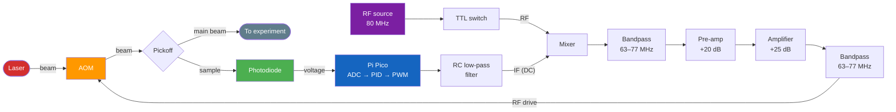

# stabilizerpi

Laser intensity stabilization using a Raspberry Pi Pico, an acousto-optic modulator (AOM), and a photodiode. A software PID controller on the Pico reads the photodiode voltage (ADC) and drives the AOM (PWM) to hold a constant laser intensity.

## Repository layout

```
firmware/
  CMakeLists.txt            CMake build file
  pico_sdk_import.cmake     Standard Pico SDK locator
  src/
    config.h                Pin map, PID gains, setpoint, timing
    pid.h / pid.c           PID controller (anti-windup, output clamping)
    main.c                  Stabilisation loop + USB serial telemetry

scripts/
  monitor.py                PC-side live voltage plot (matplotlib)
  requirements.txt          Python dependencies for monitor.py
```

## Wiring

| Signal | Pico pin | Notes |
|---|---|---|
| Photodiode output | **GP26 (ADC0)** | 0–3.3 V analog. Use a transimpedance amplifier if the raw photodiode signal is too small or the wrong polarity. |
| AOM driver input | **GP15 (PWM)** | 0–3.3 V PWM. Feed through a low-pass RC filter (e.g. 1 kΩ + 100 nF → ~1.6 kHz cutoff) to get a smooth DC level, then into the AOM driver's modulation input. |
| GND | **GND** | Common ground for Pico, photodiode circuit, and AOM driver. |

> The PWM frequency is ~30 kHz (125 MHz / 4096). A simple RC filter will remove the PWM ripple while preserving the ~1 kHz control bandwidth.

## System diagram



**Optical loop:** The laser passes through the AOM, a pickoff sends a sample to the photodiode, the Pico reads the photodiode voltage and closes the feedback loop by adjusting the AOM drive level.

**RF drive chain:** An 80 MHz source enters a TTL switch, then a mixer whose IF port receives the Pico's DC control voltage. The mixed signal passes through a bandpass filter (63–77 MHz), a pre-amplifier (+20 dB), a power amplifier (+25 dB), a second bandpass filter (63–77 MHz), and finally drives the AOM.

## Building the firmware

You need the [Raspberry Pi Pico C SDK](https://github.com/raspberrypi/pico-sdk) installed and `PICO_SDK_PATH` set.

```bash
cd firmware
mkdir build && cd build
cmake ..
make -j$(nproc)
```

This produces `stabilizerpi.uf2`. To flash:

1. Hold the **BOOTSEL** button on the Pico and plug it in via USB.
2. Copy `stabilizerpi.uf2` to the `RPI-RP2` mass-storage drive that appears.
3. The Pico reboots and starts the stabilisation loop.

## Running the live monitor

```bash
cd scripts
pip install -r requirements.txt
python monitor.py          # auto-detects serial port
python monitor.py COM5     # or specify explicitly
```

A two-panel plot shows the photodiode voltage (blue) and AOM drive voltage (red) in real time, with the setpoint drawn as a dashed line.

## Tuning the PID

Edit the gains in `firmware/src/config.h`:

```c
#define PID_KP  1.0f   // proportional
#define PID_KI  0.5f   // integral
#define PID_KD  0.01f  // derivative
```

**Quick-start procedure (Ziegler–Nichols):**

1. Set `KI = 0`, `KD = 0`.
2. Increase `KP` until the output oscillates steadily. Record this value as **K_u** and the oscillation period as **T_u**.
3. Set `KP = 0.6 * K_u`, `KI = 2 * KP / T_u`, `KD = KP * T_u / 8`.
4. Fine-tune from there. Reduce `KI` if there is overshoot; increase it if the steady-state error is too large.

Other parameters in `config.h`:

| Define | Default | Purpose |
|---|---|---|
| `SETPOINT_V` | 1.5 V | Target photodiode voltage |
| `LOOP_PERIOD_US` | 1000 (1 kHz) | Control loop rate |
| `SERIAL_DECIMATION` | 10 | Print every N-th sample (100 Hz serial rate) |
| `PID_INTEGRAL_MAX` | 2.0 | Anti-windup clamp on the integral term |

## License

MIT
